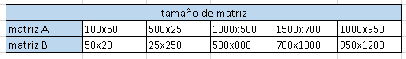
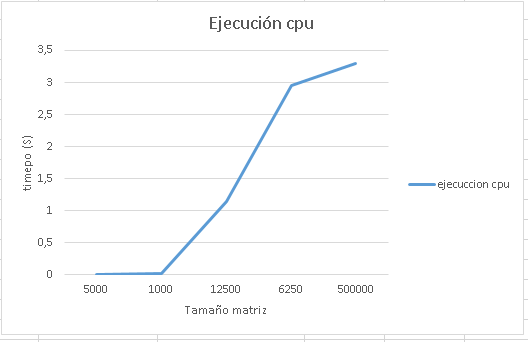
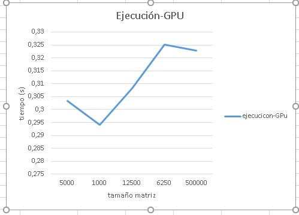
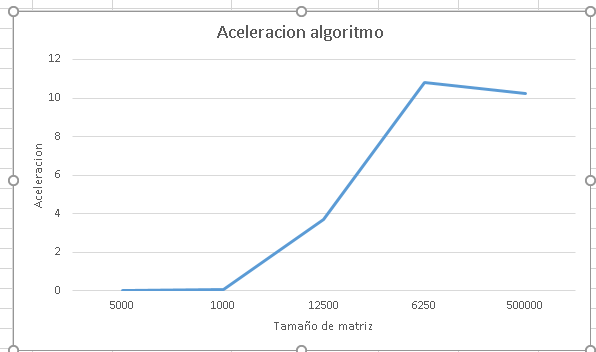
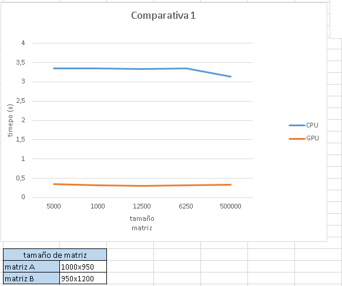
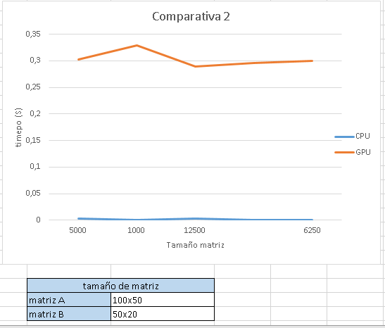

<h3 align="center">MULTIPLICACIÓN DE MATRICES EN CPU, GPU Y CON MEMORIA COMPARTIDA</h3>
 
 
 
 
 
<h3 align="center">HIGH PERFORMANCE COMPUTING</h3>
 
 
 
 
 
<h3 align="center">DOUGLAS HERNANDEZ</h3>
<h3 align="center">SEBASTIAN ARDILA AGUDELO</h3>
 
 
 
 
 
<h3 align="center">UNIVERSIDAD TECNOLÓGICA DE PEREIRA</h3>
<h3 align="center">INGENIERÍA DE SISTEMAS Y COMPUTACION</h3>
<h3 align="center">2016</h3>
 

 
<h2 >ENUNCIADO</h2>
Construir un programa que calcule la multiplicación de matrices (floats) de cualquier tamaño A(mxn) y B(nxl) en  CUDA.

Evaluar el desempeño del programa construido comparándolo con la versión secuencial del mismo en CPU

Se debe entregar un repositorio en github por equipo de trabajo que contenga el código de ambas implementaciones, documentación sobre el código donde se explique detalladamente lo que se hace y un documento  en MarkDown donde se especifiquen gráficas de tiempos y gráfica de aceleración (se hace con un promedio de tiempos). Se debe tener un apartado de conclusiones del trabajo realizado.
 
<h2 >GENERACIÓN DEL CÓDIGO</h2>
Para el Desarrollo de nuestro código, tomamos en cuenta los talleres hechos previamente, como podemos observar en el archivo **parcial1.c**, el código se divide en varias partes dónde las funciones mas importantes son **matrixMultKernelTiled**,**matrixMultKernel**,**matrixMultCPU2**, las cuales se refieren respectivamente a la función de multiplicación en gpu con memoria compartida, la funcion para gpu, y la función para cpu, estas funciones reciben tres matrices, de las cuales dos tienen valores a multiplicar y la tercera siempre es la matriz lineal donde se guardarán los resultados, los tiempos de ejecucion y aceleración se toman mediante se hace el llamado a las funciones, y las matrices resultantes son analizadas para verificar que las multiplicaciones sean correctas.
 
<h2 >PROBLEMAS QUE SE ENCUENTRAN</h2>
Se encuentran originalmente problemas en la multiplicación correcta de matrices en CPU, problemas que se resuelven haciendo un análisis escrito y concienzudo de la multiplicación. La multiplicación de las matrices en GPU se resuelve de manera similar. Actualemente encontramos un error en la multiplicación en GPU con memoria compartida apesar de revisar el libro detalladamente, la multiplicación de las matrices en **GPU tiled** funciona para todos los valores menos para el último, por lo que se procede a hacer el análisis de gráficas de tiempos de ejecución versus aceleración con la multiplicación en CPU y GPU sin tiled
 

 
<h2>RECOLECCIÓN DE DATOS</h2>
 
1. En la **tabla 1.1**, se puede observar los tamaños de las matrices usados para CPU y GPU

 
<h6>tabla 1.1</h6>
 
2. Tanto para CPU como para GPU, se toma para cada tamaño de matriz, se hacen 5 ejecuciones y se toma el promedio de las 5 ejecuciones como podemos observar en la **gráfica 1.1** para la CPU y la **gráfica 1.2** para la GPU

 
<h6>gráfica 1.1</h6>
 

 
<h6>gráfica 1.2</h6>
 
3. En la gráfica de abajo **gráfica 1.3**, se puede observar claramente la acelaracion del algoritmo de multiplicacion de matrices MxN usando CUDA. esta aceleracion nos indica el impacto que se tiene ejecutar codigo de computacion en GPUs, ya que podemos observar que para matrices de tamaño muy grande la GPU trabaja mas rapidamente

 
<h6>gráfica 1.3</h6>
 
4. En las **gráficas 1.4** y **1.5** respectivamente podemos observar el comportamiento de la ejecucion del algoritmo para tamaños de matrices muy pequeñas y muy grandes, como se puede ver, en las matrices pequeñas es mejor el tiempo de ejecuccion de la CPU, esto se debe a que es demorado hacer todo el proceso de separar memoria en el device, hacer la copia de los datos de CPU to GPU y GPU to CPU mas el tiempo de ejecuccion en el divice, esto impacta en el performance del algoritmo.
 

 
<h6>gráfica 1.4</h6>
 

 
<h6>gráfica 1.5</h6>
 

 
<h2>CONCLUSIONES</h2>
1. Los tiempos de ejecución en CPU son mejores cuando se trata de matrices pequeñas
2. Los tiempos de ejecución en GPU son mejores cuando se trata de matrices muy grandes
3. El procesamiento de grandes cantidades de datos funciona mejor en GPU porque se utiliza la tarjeta gráfica como recurso.
4. Podemos destacar que el performance, de ciertos algoritmos computacionales se ven muy bien en las GPU, trabajar con hilos siempre sera una forma de mejorar el desempeño de nuestros algoritmos, ventajas al trabajar con GPU son muchas a la hora de conseguir que un computador responda rapidamente a nuestras peticiones, desventajas podemos decir que es confuso inicialmente programar en las GPU, ya que nos toca cambiar la forma de ver como se procesa el algoritmo en el computador, a futuro podriamos mejorar nuestros conocimientos en cuanto a programacion en GPUs y tal vez a provechar la velocidad que estas nos brindan para implementar llamados tipo AJAX que son muy comunes en los servicios WEB
 
