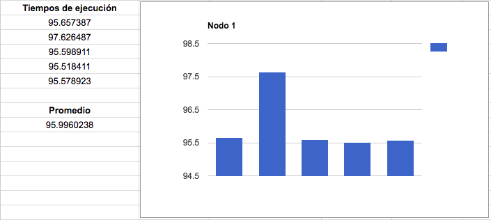
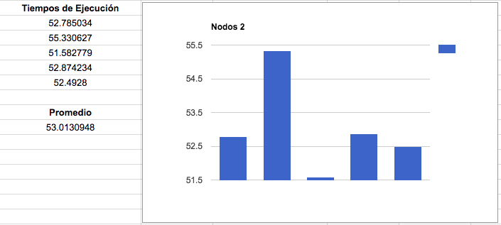
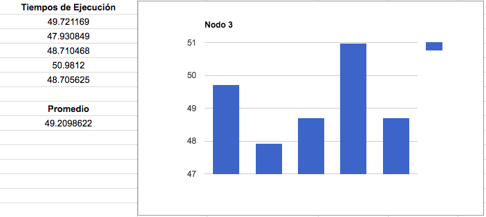
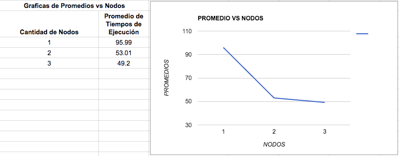
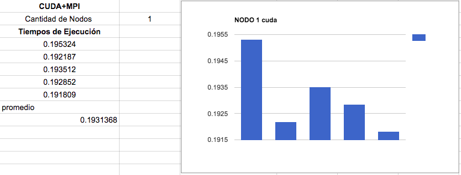
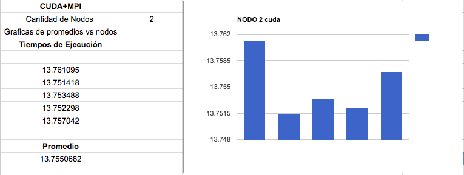
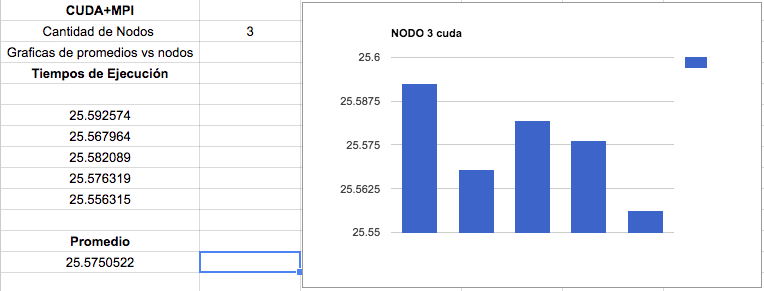
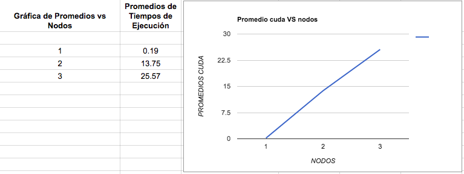
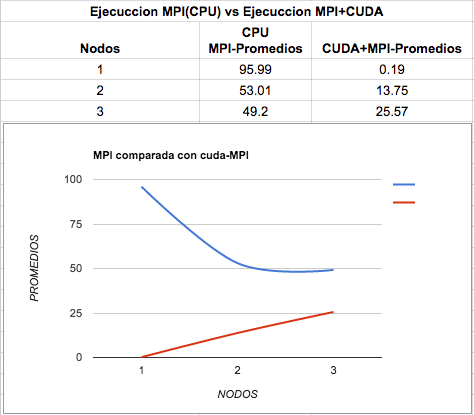

<h3 align="center">MULTIPLICACIÓN DE MATRICES DE GRAN TAMAÑO UTILIZANDO MPI Y CUDA</h3>
<br>
<br>
<br>
<br>
<br>
<h3 align="center">HIGH PERFORMANCE COMPUTING</h3>
<br>
<br>
<br>
<br>
<br>
<h3 align="center">DOUGLAS HERNANDEZ</h3>
<h3 align="center">SEBASTIAN ARDILA AGUDELO</h3>
<br>
<br>
<br>
<br>
<br>
<h3 align="center">UNIVERSIDAD TECNOLÓGICA DE PEREIRA</h3>
<h3 align="center">INGENIERÍA DE SISTEMAS Y COMPUTACIÓN</h3>
<h3 align="center">2016</h3>
<br>
<HR width=100% align="center">
<br>
<h2 >ENUNCIADO</h2>
**1.** Construir una aplicación que realice la multiplicación de matrices de gran tamaño utilizando MPI y CUDA.
<br>

**2.** La aplicación deberá distribuir el trabajo a realizarse en 4 nodos máximo.
<br>

**3.** Para cada uno de los nodos envueltos en el procesamiento se deberá realizar el cálculo necesario sobre la GPU.
<br>

**4.** El tamaño de las matrices a multiplicar será definido por cada uno de los estudiantes y será tenido en cuenta como un 10% de ésta nota.
<br>

**5.** Se tendrá que hacer un análisis de tiempo que muestre cómo el algoritmo desarrollado se comporta al correr usando 1 solo nodo, usando 2, usando 3 y finalmente 4. (10%)
<br>

**6.** Se deberá comparar la solución obtenida con una donde se usen solamente CPU’s. Esta comparativa deberá también incluir tiempos de ejecución y gráficas de aceleración. (10%). De nuevo hacer el análisis para cada uno de los nodos.
<br>

**7.** Será necesario para el desarrollo del trabajo que los estudiantes investiguen sobre el proceso de compilación de aplicaciones que usan OPENMPI+CUDA.
<br>

**8.** El correcto funcionamiento de la aplicación será evaluado, esto significa incluir una rutina de comparación de resultados que deberá ser ejecutada sólo cuando el profesorlo indique y con ánimo de verificar que la multiplicación es correcta. (10%)
<br>

**9.** La calidad y claridad del reporte que se presentará utilizando el markdown del repositorio tendrá un peso de 10%.
<br>

**10.** La entrega se hará de forma individual y tendrá un peso en la evaluación del 50%. Esto indica la claridad en la explicación, el conocimiento de los comandos básicos para ejecutar programas através de slurm y la comprensión en los procesos de compilación.
<br>
<br>
**NOTA:** Recuerden que el recurso (Clúster) es compartido por todos y será vital el buen manejo que le demos al mismo. Verificar siempre si ustedes como primeros usuarios han dejado alguna tarea que no finaliza nunca y matar el trabajo. No dejen el desarrollo para la última semana porque probablemente van a estar todos haciendo pruebas a última hora. Si tienen problemas de ejecución por caída del cluster no olviden avisarme. Pueden crear grupos de trabajo de máximo 2 estudiantes.
<br>
<h2 >GENERACIÓN DEL CÓDIGO</h2>
La solución del enunciado se compone de dos carpetas en dónde se encuentran dos soluciones, la primera solución es la que usa MPI (CPU) únicamente, y esta se encuentra en la carpeta **src_mpi_cpu**, la segunda solución utiliza MPI+CUDA y se encuentra en la carpeta **src_cuda_mpi**, cada solución tiene como objetivo la ejecución de matrices con diferente cantidad de nodos en entornos diferentes, la toma de tiempos y comparación de estos. Cada solución contiene los mismos archivos que solo difieren en el código implementado en el archivo **multi_mpi.c**.
<br>
<br>
Para la generación del código en el momento de usar mpi+cuda al mismo tiempo usamos dos archivos donde se encuentra el código de mpi y el de cuda respectivamente, las funciones que se encuentran en el archivo de cuda llamado **multi_mpi_cuda.cu** servirán para multiplicar las matrices bajo cuda, a su vez estas funciones se pueden llamar como funciones externas, esto gracias a que un archivo aparte llamado **extern.h** hace posible esta labor. Desde el archivo mpi llamado **multi_mpi.c** se puede importar el archivo extern.h como una librería, permitiendo usar sus funciones, es de este modo al ejecutarse cada nodo usando mpi se hace el respectivo calculo con gpu usando las librerias externas previamente definidas.
Los siguientes comandos permiten usar cuda+mpi y compilar los archivos:

``` /usr/local/bin/mpicxx -o multi.o -c multi_mpi.c ```

``` "/usr/local/cuda-8.0"/bin/nvcc -ccbin g++ -m64 -gencode arch=compute_30,code=sm_30 -gencode arch=compute_35, code=sm_35 -gencode arch=compute_37,code=sm_37 -gencode arch=compute_50,code=sm_50 -gencode arch=compute_52,code=sm_52 -gencode arch=compute_60,code=sm_60 -gencode arch=compute_60,code=compute_60 -o multi_cuda.o -c multi_mpi_cuda.cu```

``` /usr/local/bin/mpicxx -o multi multi.o multi_cuda.o  -L"/usr/local/cuda-8.0"/lib64 -lcudart ```

Aquí podemos ver como el archivo extern.h deja usar las librerias de otro programa:
<br>

<br>
Luego al exportar este archivo podemos usar las funciones:
<br>

<br>
De esta forma definimos cuales funciones usaremos:

<br>
<h2 >PROBLEMAS QUE SE ENCUENTRAN</h2>
Tuvimos problemas a la hora de entender como compilar el programa para poder compilar y ejecutar cuda+mpi, por lo que tuvimos que investigar de varias fuentes mencionadas en la sección de referencias, también tuvimos problemas al correr los tiempos de ejecución con la implementación y usando solo CPU.
<br>
<HR width=100% align="center">
<br>
<h2>RECOLECCIÓN DE DATOS</h2>
Usaremos matrices de 5000x4000x5000 inicialmente para agilizar el proceso de análisis.
<br>
<br>
En primer lugar usamos la solución en CPU utilizando MPI para tomar 5 tiempos con 1 nodo, 5 tiempos con 2 nodos y 5 tiempos con 3 nodos.
<br>
**MPI (CPU)**
Usando 1 nodo:
<br>

<br>
<br>
Usando 2 nodos:
<br>

<br>
<br>
Usando 3 nodos:
<br>

<br>
<br>
Promedio de los tiempos de ejecución vs la cantidad de nodos en cada ejecución:
<br>

<br>
**Descripción:**
<br>
En esta grafica podemos notar como el tiempo de ejecuccion del algoritmo disminuye significativamente cade vez que le agregamos mas nodos a la ejecuccioni se puede notar el uso de MPI repartiendo trabajo entre los nodos del cluster
<br>
<br>
En segundo lugar, haremos la toma de los cálculos del promedio de los tiempos de ejecución del algoritmo usando sólo **MPI+CUDA**
<br>
<br>
Usando 1 nodo:
<br>

<br>
<br>
Usando 2 nodos:
<br>

<br>
<br>
Usando 3 nodos:
<br>

<br>
<br>
Promedio de los tiempos de ejecución con MPI+CUDA vs la cantidad de nodos en cada ejecución:
<br>

<br>
**Descripción:**
<br>
En esta grafica se ve el comportamiento del algoritmo ejecutandose con cuda + MPI, por tener matrices pequeñas el algorimto pareciera que no hace un performance óptimo pero si consideramos que se gasta tiempo en copiar memoria de cpu a GPU es evidente que suceda este comportamiento, pero lo que si podemos predecir y es claro con la gráfica es que si tenemos matrices más grandes tendremos una mejora en los tiempos ya que se ve reflejado con las gráficas anteriores.
<br>
<br>
En tercer lugar, hacemos una comparativa del comportamiento con diferente cantidad de nodos entre MPI+CUDA y CPU (MPI).
<br>
<br>
Esta es la gráfica comparando tiempos de ejcución de **solo CPU con MPI** vs **MPI+CUDA**:
<br>

<br>
(En esta grafica el color azul es MPI y el rojo MPI+CUDA)
<br>
**Descripción:**
<br>
En esta gráfica se aprecia evidentemente la mejora que se ve en tiempo de ejecucción del algoritmo con CUDA+MPI con respecto a MPI solo, si tuvieramos matrices mas grandes seria mas obvio las diferencias, pero a pesar de los tamaños trabajados podemos ver como cuda mejora considerablemente el tiempo de ejecucción, en la gráfica podemos ver como usando matrices relativamente pequeñas para 1 nodo en CPU se demora un tiempo considerable en ejecutar, mientras que para MPI+CUDA y la misma cantidad de nodos este tiempo de ejecución y casi nulo, también se puede apreciar como para MPI+CUDA funciona mejora usar matrices de tamaño considerablemente elevado, ya que al usar matrices pequeñas el tiempo de ejecución se ve afectado entre más número de nodos, así como se puede notar en la pendiente, mientras que para cpu mejora el performance de la ejecución del mismo tamaño de las matrices.
<br>
<br>
<HR width=100% align="center">
<br>

<br>
<h2>REFERENCIAS</h2>
1. https://www.pdc.kth.se/resources/software/old-installed-software/mpi-libraries/cuda-and-mpi
2. https://github.com/kala855/hpccourse/tree/master/mpiexamples/mpi_cuda_hello_world
3. http://lsi.ugr.es/jmantas/pdp/ayuda/ayuda.php
<br>
<h2>CONCLUSIONES</h2>
1. Apesar de que utilizamos matrices de un tamaño moderado, podemos notar como el performance de las operaciones se mejora significativamente cuando repartimos partes de las tareas en diferentes nodos, podemos ver que dividir un problema grande como lo es la multiplicación de matrices grandes en pequeñas operaciones el resultado sera mucho mas rápido de obtener.

2. La combinación de dos tecnologías como MPI y CUDA significan un gran avance para el mejoramiento de los algoritmos actuales, ya que para procesamientos pesados como renderización de imágenes o una red de neuronas de inteligencia artificial es muy posible combinarlos con estas tecnologías logrando crear un buen desempeño a nivel de recursos.
<br>
